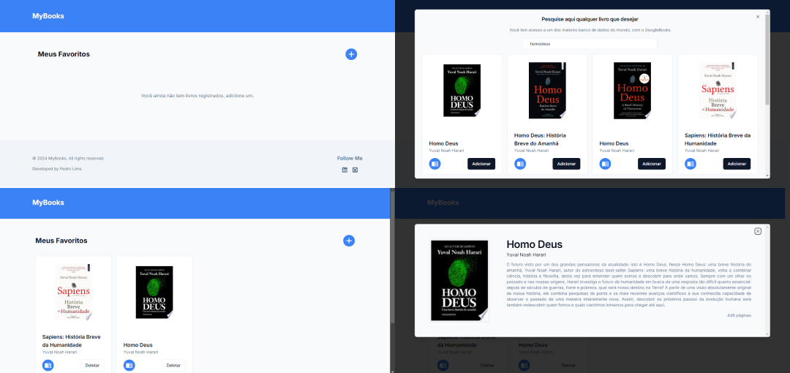

# MyBooks

Uma aplicação de página única (SPA) para criar sua lista de livros preferidos.

A página web foi criada por mim e inspirada em outras aplicações já existentes, adaptando seus designs e recursos. A aplicação foi desenvolvida utilizando tecnologias como TypeScript, Next, Firebase, TailwindCSS e GoogleBooksAPI.

</br>

## Índice

- [Screenshots](#screenshots)
- [Objetivos](#objetivos)
- [Minha caminhada](#minha-caminhada)
  - [Propriedades e Tecnologias](#propriedades-e-tecnologias)
  - [Meu aprendizado](#meu-aprendizado)
- [Rodando o projeto](#rodando-o-projeto)
- [Autor](#autor)

</br>

## Screenshots



</br>

## Objetivos

O principal objetivo deste projeto foi elaborar um CRUD utilizando o Firebase, com sua ferramenta Cloud Firestore.

Os usuários têm a capacidade de:
- Criar suas próprias listas de livros favoritos e obter mais informações sobre cada obra.

</br>

## Minha caminhada

- [x] Configuração, conexão e serviços do banco de dados (Firebase)
- [x] Conexão e serviços da API (Google Books API)
- [x] Protótipo do design (V0)
- [x] Desenvolvimento e estilização (Next e Shadcn)

</br>

## Propriedades e Tecnologias

- TypeScript
- Next.js
- Firebase
- TailwindCSS
- Google Books API
- Shadcn
- React Icons
- Zod
- Axios
- ESLint
- V0
- Figma

</br>

## Meu aprendizado

Neste projeto, tive a oportunidade de colocar em prática conhecimentos sobre o banco de dados em nuvem do Firebase, a biblioteca de componentes customizáveis da Shadcn e o desenvolvimento de interfaces utilizando inteligência artificial da V0. Contudo, neste artigo, irei destacar algumas dicas sobre o Firebase.

O Cloud Firestore é um banco de dados NoSQL flexível e escalonável. Minha primeira impressão foi bastante positiva, com uma experiência intuitiva, provavelmente devido à documentação bem estruturada.

Para utilizar a ferramenta, basta criar sua conta no site do Firebase e configurar seu projeto no console da plataforma. Nas configurações, você encontrará uma máscara de conexão semelhante a esta:

```tsx
import { initializeApp } from "firebase/app";
import { getFirestore } from "firebase/firestore";

const apiKey = process.env.NEXT_PUBLIC_FIREBASE_APIKEY;

const firebaseConfig = {
  apiKey: apiKey,
  authDomain: "fire-crud-ba674.firebaseapp.com",
  projectId: "fire-crud-ba674",
  storageBucket: "fire-crud-ba674.appspot.com",
  messagingSenderId: "862513445158",
  appId: "1:862513445158:web:3fcd5127a51bec6b60a9e7"
};

const app = initializeApp(firebaseConfig);

const db = getFirestore(app);

export { db };
```

Com isso, você já terá acesso ao banco de dados e poderá criar os verbos de interação necessários.

```tsx
import { collection, doc, DocumentData, getDocs, query, updateDoc } from "firebase/firestore";
import { db } from "../firebaseConfig";

export async function getBooksAccess() {
  const q = query(collection(db, "books"));
  const response = await getDocs(q);
  return response;
}

export async function updateBooksAccess(body: DocumentData, id: string) {
  const book = doc(db, "books", id);
  const response = await updateDoc(book, body);
  return response;
}
```

O Firebase estrutura seu banco de dados em coleções e documentos, onde os documentos estão dentro de cada coleção. Para acessar uma coleção, basta passar o banco de dados do projeto e o nome da coleção. Já para acessar um documento específico, além do banco e do nome da coleção, você precisa do ID do documento.

Veja mais detalhes na [documentação oficial do Firebase](https://firebase.google.com/docs/firestore?hl=pt)

</br>

## Rodando o projeto


### Acesse a aplicação via web [aqui!](https://fire-crud-kappa.vercel.app/)

#### Ou instale na sua máquina. Para conferir a versão final, é só realizar os seguintes passos:

### 1 - Clonando o Projeto:
Navegue até o diretório onde deseja clonar o projeto. Abra o terminal com o GitBash e execute o comando:

```bash
git clone URL_DO_REPOSITORIO
```
Substitua URL_DO_REPOSITORIO pela URL do repositório deste projeto.

#### 2 - Instalando Dependências:
Navegue até a pasta clonada do projeto e execute o comando no terminal:

```bash
npm install
```
ou
```bash
yarn install
```

#### 3 - Executando o Projeto:
Ainda na pasta do projeto, execute o comando no terminal:

```bash
npm run dev
```

Isso iniciará o servidor de desenvolvimento do Next.js. Você ainda precisará criar seu projeto no console da plataforma do Firebase e alterar as informações da máscara de conexão e atualizar as variáveis de ambiente, conforme já explicado acima.

</br>

## Autor

- LinkedIn - [Pedro A. Lima](https://www.linkedin.com/in/pedroalima6/)